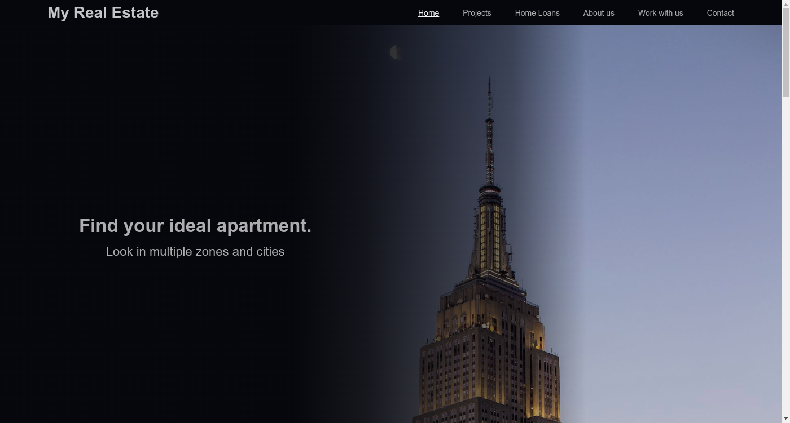

<h1 align="center" id="title">Real Estate Web Site</h1>

	
	
	
	

  
  

Website of a Real Estate Business, built with Rect JS, minfied with Webpack and transpilled with Babel.  The router was applied using the [react-router-dom](https://reactrouter.com/) library and it contains the following routes: Home, Projects, Home Loans, About us, Work with us, Contact. You can here see the [project deployed](https://real-estate-monoald.netlify.app/home-loans).

## Environment Configuration
Simple npm v8.6.0 environment, this project is minify with **Webpack** and transpiled with **Babel** for a great browser compatibility. 
### Installation
Clone repository:

    git@github.com:monoald/real-estate-web.git

Install dependencies:

    npm install

### Run Local
On file `webpack.config.js` line 11 change `publicPath` to:

    publicPath:  '/',

On file `index.js` line 11 change to:

    <BrowserRouter>

Run:

    npm run start

### Deploy 
This project was deployed with the npm package [gh-pages](https://www.npmjs.com/package/gh-pages), which simplifies the process to deploy React JS projects on Github Pages
Run:

    npm run deploy

Production code will be sent to `deploy` new branch, you can change the name of the branch on `package.json` line 9

    "deploy":  "msg=`git show-branch --no-name HEAD` && gh-pages -b <BRANCH_NAME> -d dist -m \"$msg\"  "

Also I deploy this project on netlify while I fix the problem with the SPA routes.

## Design
The desing was created by me, but using no design tool
## License

> This project is licensed under the MIT License
## Extra
### Flowchart
You can see the flowchart [here](https://www.figma.com/community/file/1139734914250866855).
